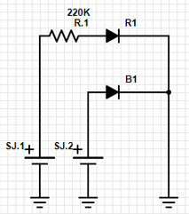
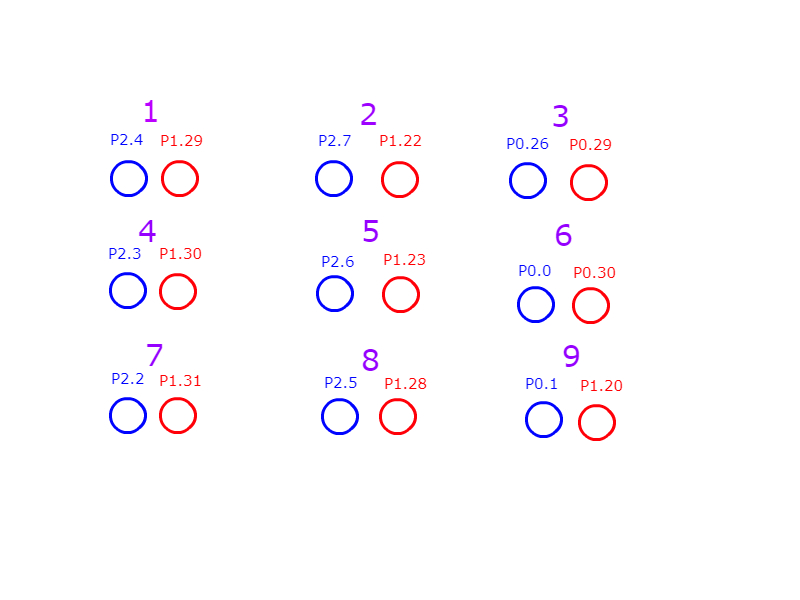
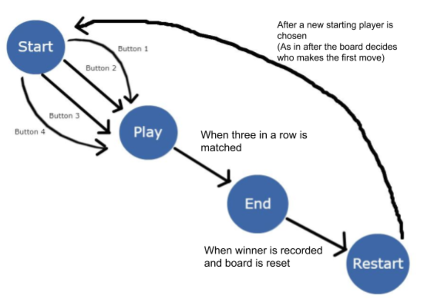

# CMPE30_TicTacToe

**Description**: A hands on Tic-Tac-Toe game using a SJ One Board, eighteen LEDs, and a breadboard. Like any ordinary Tic-Tac-Toe game, two players take turn to line up three of their marks in a row. Using the four buttons on the SJ One Board, the players are able to move vertically/horziontally and place their marks (red/blue).

**Materials**:

Red/Blue LEDs           $1.62

SJ One Board            $80.00

Male-Female Wires       $1.50

Breadboard              $2.80

220k Ohm Resistors      $1.35

Total:                  $87.27

**Schematic**: This is an example of how one pair of diode is attached to the SJ One Board. SJ.1 and SJ.2 represents the two pins it is connected to on the SJ.1 Board. R1 and B1 are both RGB diodes with R1 being the diode displaying red and B1 being the diode displaying blue. The diodes are connected in the arrangement below and with the pins listed. 
 

**State Machine**:

**Software Used**: The software used to code this project was Eclipse, specially made for the SJ One Board. After the code is written, it is uploaded onto the board with a program called HyperLoad. For debugging and testing out the code, Hercules was used. To make sure certain functions of the code worked, we made it print out messages which were displayed onto Hercules.
